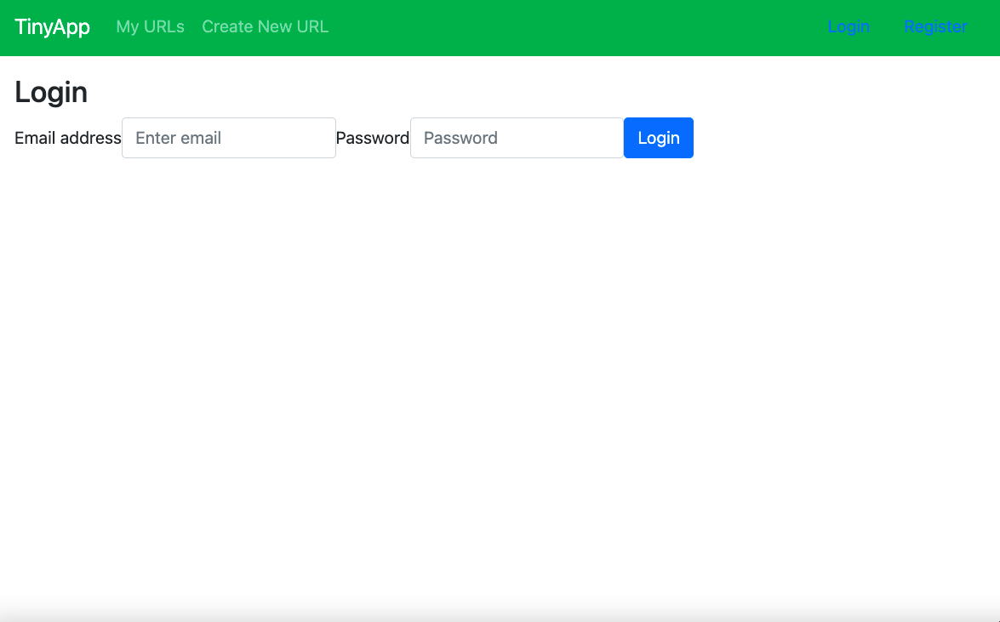
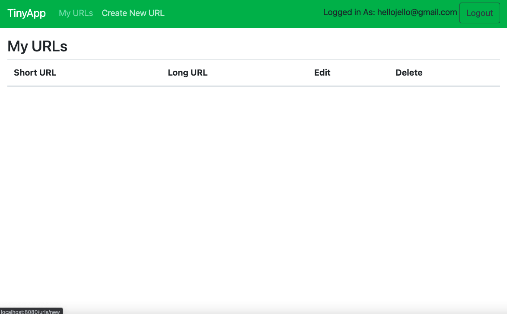
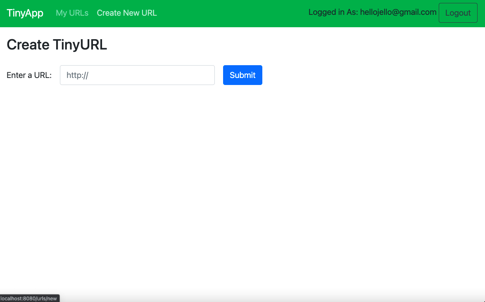
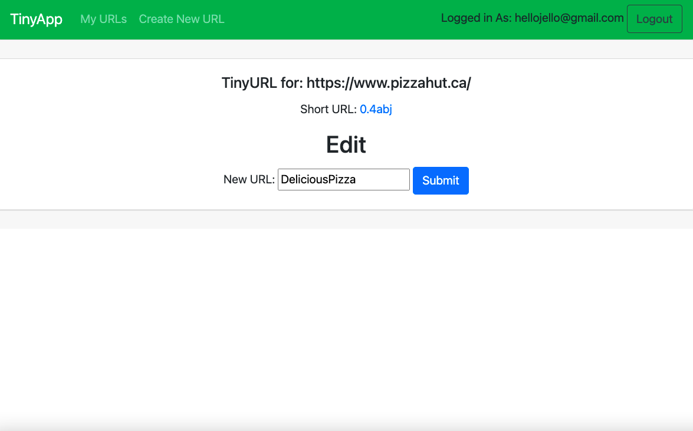
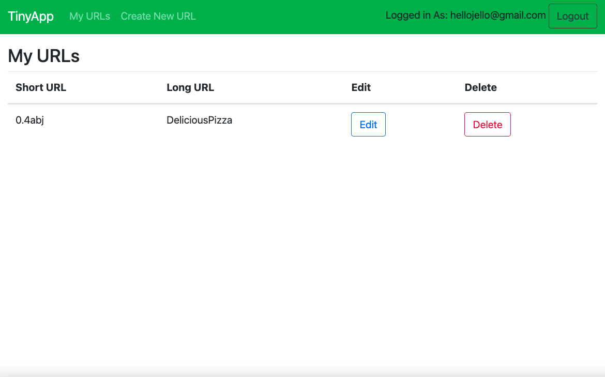
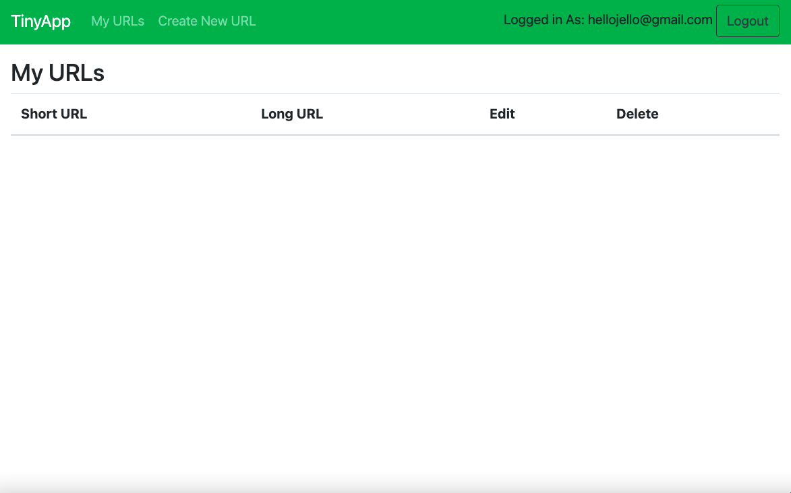

# TinyApp Project :computer:

 TinyApp is a full stack web application built with Node and Express that allows users to shorten long URLs (à la bit.ly). 

 Users can store shortened urls for future use / reference and also have the ability to edit :technologist: or delete urls :wastebasket: with a push of a button.

## Final Product

First a user needs to log in (or click the link to register as a new user).

Once logged in (or newly registered) the user is directed to the URLS page.

Now the user can select "Create New URL". Now the user can create their first shortened URL by submitting a URL of their choice.

Once the URL of choice has been submitted, the user can now see a clickable short URL has been generated.  There is also an option to edit/or rename the URL if desired. In this case the user has desired it and is renaming their pizzahut link as DeliciousPizza :pizza:

Once the user has submitted their short URL with any custom naming applied, the user is directed to their URL database. If the user clicks on the "edit" button here, they will return back to the previous page where they can edit the Long URL name. If the "delete button is clicked, the item will be removed from the database

## Dependencies

- Node.js
- Express
- EJS
- bcrypt
- body-parser
- cookie-session

## Getting Started

- Install all dependencies (using the `npm install` command).
- Run the development web server using the `node express_server.js` command.